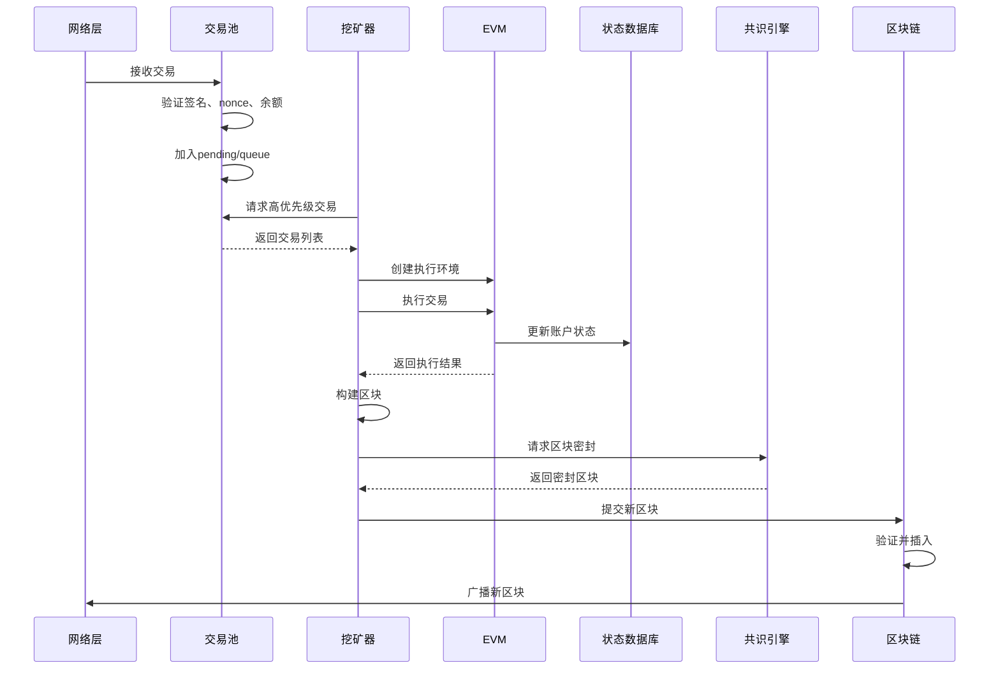
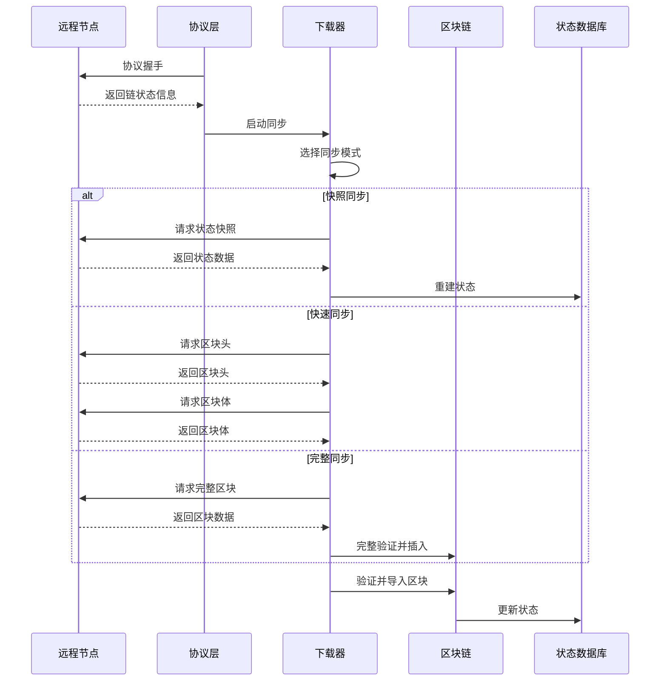

# 阐述Geth在以太坊生态中的定位
<font style="color:rgba(0, 0, 0, 0.9);background-color:rgb(252, 252, 252);">Geth（Go-Ethereum）是以太坊生态系统的核心基础设施组件，其定位涵盖技术实现、网络维护和开发者支持等多个层面；</font>

## **<font style="color:rgba(0, 0, 0, 0.9);background-color:rgb(252, 252, 252);">官方执行层客户端（Execution Layer Client）</font>**
+ **<font style="color:rgba(0, 0, 0, 0.9);background-color:rgb(252, 252, 252);">核心职责</font>**
    - <font style="color:rgba(0, 0, 0, 0.9);background-color:rgb(252, 252, 252);">Geth 负责处理以太坊网络的</font>**<font style="color:rgba(0, 0, 0, 0.9);background-color:rgb(252, 252, 252);">交易执行、状态管理和智能合约运行。</font>**<font style="color:rgba(0, 0, 0, 0.9);background-color:rgb(252, 252, 252);">在“合并”（The Merge）后，以太坊采用执行层-共识层分离架构，Geth 作为执行层客户端，专注交易处理与状态更新，而区块确认由共识层客户端（如 Prysm、Lighthouse）完成。两者通过 </font>**<font style="color:rgba(0, 0, 0, 0.9);background-color:rgb(252, 252, 252);">Engine API</font>**<font style="color:rgba(0, 0, 0, 0.9);background-color:rgb(252, 252, 252);"> 协同工作</font>
+ **<font style="color:rgba(0, 0, 0, 0.9);background-color:rgb(252, 252, 252);">技术实现</font>**
    - <font style="color:rgba(0, 0, 0, 0.9);background-color:rgb(252, 252, 252);">内置 </font>**<font style="color:rgba(0, 0, 0, 0.9);background-color:rgb(252, 252, 252);">EVM（以太坊虚拟机）</font>**<font style="color:rgba(0, 0, 0, 0.9);background-color:rgb(252, 252, 252);">：在 </font>`<font style="color:rgba(0, 0, 0, 0.9);background-color:rgb(252, 252, 252);">core/vm</font>`<font style="color:rgba(0, 0, 0, 0.9);background-color:rgb(252, 252, 252);"> 模块中实现智能合约的字节码解释执行 </font>
    - **<font style="color:rgba(0, 0, 0, 0.9);background-color:rgb(252, 252, 252);">状态管理</font>**<font style="color:rgba(0, 0, 0, 0.9);background-color:rgb(252, 252, 252);">：通过 </font>`<font style="color:rgba(0, 0, 0, 0.9);background-color:rgb(252, 252, 252);">core/state</font>`<font style="color:rgba(0, 0, 0, 0.9);background-color:rgb(252, 252, 252);"> 模块维护 Merkle Patricia Trie（MPT）结构，确保账户状态的可验证性 </font>

## **<font style="color:rgba(0, 0, 0, 0.9);background-color:rgb(252, 252, 252);"> 全节点与轻节点支持者	</font>**
<font style="color:rgba(0, 0, 0, 0.9);background-color:rgb(252, 252, 252);">Geth 支持多种节点运行模式，满足不同场景需求</font>

+ **<font style="color:rgba(0, 0, 0, 0.9);background-color:rgb(252, 252, 252);">全节点（Full Node）：</font>**<font style="color:rgba(0, 0, 0, 0.9);background-color:rgb(252, 252, 252);">下载并验证全部区块链数据（区块头、交易、状态），提供最高安全性和数据完整性，但需大量存储（主网需 1TB+ SSD）</font>
+ **<font style="color:rgba(0, 0, 0, 0.9);background-color:rgb(252, 252, 252);">轻节点（Light Node）：</font>**<font style="color:rgba(0, 0, 0, 0.9);background-color:rgb(252, 252, 252);">仅同步区块头，按需请求数据，适用于资源受限设备（如移动端）</font>
+ **<font style="color:rgba(0, 0, 0, 0.9);background-color:rgb(252, 252, 252);">归档节点（Archive Node）：</font>**<font style="color:rgba(0, 0, 0, 0.9);background-color:rgb(252, 252, 252);">保留所有历史状态快照，支持任意历史状态查询，存储需求极大（10TB+）</font>

## **<font style="color:rgba(0, 0, 0, 0.9);background-color:rgb(252, 252, 252);"> 开发者核心工具链</font>**
<font style="color:rgba(0, 0, 0, 0.9);background-color:rgb(252, 252, 252);">Geth 提供丰富的开发接口和工具，赋能以太坊应用生态</font>

+ **<font style="color:rgba(0, 0, 0, 0.9);background-color:rgb(252, 252, 252);">JSON-RPC/WebSocket API</font>**<font style="color:rgba(0, 0, 0, 0.9);background-color:rgb(252, 252, 252);">：通过 </font>`<font style="color:rgba(0, 0, 0, 0.9);background-color:rgb(252, 252, 252);">eth</font>`<font style="color:rgba(0, 0, 0, 0.9);background-color:rgb(252, 252, 252);">、</font>`<font style="color:rgba(0, 0, 0, 0.9);background-color:rgb(252, 252, 252);">net</font>`<font style="color:rgba(0, 0, 0, 0.9);background-color:rgb(252, 252, 252);">、</font>`<font style="color:rgba(0, 0, 0, 0.9);background-color:rgb(252, 252, 252);">web3</font>`<font style="color:rgba(0, 0, 0, 0.9);background-color:rgb(252, 252, 252);"> 等模块，支持开发者查询链上数据、发送交易、部署合约（如 MetaMask 依赖此接口）</font>
+ **<font style="color:rgba(0, 0, 0, 0.9);background-color:rgb(252, 252, 252);">开发者私有链</font>**<font style="color:rgba(0, 0, 0, 0.9);background-color:rgb(252, 252, 252);">：通过 </font>`<font style="color:rgba(0, 0, 0, 0.9);background-color:rgb(252, 252, 252);">--dev</font>`<font style="color:rgba(0, 0, 0, 0.9);background-color:rgb(252, 252, 252);"> 模式快速启动本地测试网，支持预分配账户、自动挖矿，无需消耗真实 Gas</font>
+ **<font style="color:rgba(0, 0, 0, 0.9);background-color:rgb(252, 252, 252);">配套工具集</font>**<font style="color:rgba(0, 0, 0, 0.9);background-color:rgb(252, 252, 252);">：</font>
    - `<font style="color:rgba(0, 0, 0, 0.9);background-color:rgb(252, 252, 252);">abigen</font>`<font style="color:rgba(0, 0, 0, 0.9);background-color:rgb(252, 252, 252);">：生成智能合约的 Go 语言绑定代码，简化合约调用。</font>
    - `<font style="color:rgba(0, 0, 0, 0.9);background-color:rgb(252, 252, 252);">evm</font>`<font style="color:rgba(0, 0, 0, 0.9);background-color:rgb(252, 252, 252);">：独立运行 EVM 字节码，用于合约调试</font>

## **<font style="color:rgba(0, 0, 0, 0.9);background-color:rgb(252, 252, 252);">网络性能与安全基石</font>**
+ **<font style="color:rgba(0, 0, 0, 0.9);background-color:rgb(252, 252, 252);">同步机制优化</font>**<font style="color:rgba(0, 0, 0, 0.9);background-color:rgb(252, 252, 252);">：支持 </font>**<font style="color:rgba(0, 0, 0, 0.9);background-color:rgb(252, 252, 252);">快照同步（Snap Sync）</font>**<font style="color:rgba(0, 0, 0, 0.9);background-color:rgb(252, 252, 252);">，通过并行下载状态数据，大幅提升新节点同步速度（较传统全同步快 5-10 倍）</font>
+ **<font style="color:rgba(0, 0, 0, 0.9);background-color:rgb(252, 252, 252);">交易池管理</font>**<font style="color:rgba(0, 0, 0, 0.9);background-color:rgb(252, 252, 252);">：</font>`<font style="color:rgba(0, 0, 0, 0.9);background-color:rgb(252, 252, 252);">core/txpool</font>`<font style="color:rgba(0, 0, 0, 0.9);background-color:rgb(252, 252, 252);"> 模块高效验证、排序和广播交易，确保网络吞吐量；</font>
+ **<font style="color:rgba(0, 0, 0, 0.9);background-color:rgb(252, 252, 252);">安全加固</font>**<font style="color:rgba(0, 0, 0, 0.9);background-color:rgb(252, 252, 252);">：持续修复关键漏洞（如日志索引器缺陷），保障节点数据完整性 </font>


## **<font style="color:rgba(0, 0, 0, 0.9);background-color:rgb(252, 252, 252);">生态兼容性与标准化</font>**
+ **<font style="color:rgba(0, 0, 0, 0.9);background-color:rgb(252, 252, 252);">协议兼容性</font>**<font style="color:rgba(0, 0, 0, 0.9);background-color:rgb(252, 252, 252);">：作为以太坊黄皮书（Yellow Paper）的官方实现，Geth 是协议更新的参考标准，确保与其他客户端（如 Besu、Nethermind）的互操作性</font>
+ **<font style="color:rgba(0, 0, 0, 0.9);background-color:rgb(252, 252, 252);">多网络支持</font>**<font style="color:rgba(0, 0, 0, 0.9);background-color:rgb(252, 252, 252);">：通过参数切换主网（</font>`<font style="color:rgba(0, 0, 0, 0.9);background-color:rgb(252, 252, 252);">--mainnet</font>`<font style="color:rgba(0, 0, 0, 0.9);background-color:rgb(252, 252, 252);">）、测试网（如 </font>`<font style="color:rgba(0, 0, 0, 0.9);background-color:rgb(252, 252, 252);">--sepolia</font>`<font style="color:rgba(0, 0, 0, 0.9);background-color:rgb(252, 252, 252);">）及私有链（自定义 </font>`<font style="color:rgba(0, 0, 0, 0.9);background-color:rgb(252, 252, 252);">--networkid</font>`<font style="color:rgba(0, 0, 0, 0.9);background-color:rgb(252, 252, 252);">）</font>

## **<font style="color:rgba(0, 0, 0, 0.9);background-color:rgb(252, 252, 252);">总结：Geth 的核心价值</font>**
| 维度 | 贡献 | **<font style="color:rgba(0, 0, 0, 0.9);">技术依据</font>** |
| --- | --- | --- |
| **<font style="color:rgba(0, 0, 0, 0.9);">协议权威性</font>** | <font style="color:rgba(0, 0, 0, 0.9);">以太坊基金会维护的参考实现，推动协议标准化</font> | <font style="color:rgba(0, 0, 0, 0.9);">严格遵循黄皮书规范，主导硬分叉升级</font> |
| **<font style="color:rgba(0, 0, 0, 0.9);">开发者体验</font>** | <font style="color:rgba(0, 0, 0, 0.9);">提供 RPC 接口、私有链工具，降低 DApp 开发门槛</font> | <font style="color:rgba(0, 0, 0, 0.9);">支持主流开发框架（Hardhat、Truffle）集成</font> |
| **<font style="color:rgba(0, 0, 0, 0.9);">网络去中心化</font>** | <font style="color:rgba(0, 0, 0, 0.9);">全球最大节点占比（约 80%），维护网络抗审查性</font> | <font style="color:rgba(0, 0, 0, 0.9);">开源架构吸引社区参与，P2P 节点发现机制增强鲁棒性</font> |
| **<font style="color:rgba(0, 0, 0, 0.9);">持续演进</font>** | <font style="color:rgba(0, 0, 0, 0.9);">高频迭代（如 v1.15.11 优化 RPC 性能），适配以太坊 2.0 扩展需求</font> | <font style="color:rgba(0, 0, 0, 0.9);">修复卡顿、提升交易池重组速度</font> |


# Go-Ethereum 核心模块交互关系解析
## 1. 区块链同步协议（eth/66, eth/67, eth/68）

### 1.1 协议版本演进

Go-Ethereum支持多个以太坊协议版本，每个版本都带来了重要的优化：

```go
// eth/protocols/eth/protocol.go
const (
    ETH66 = 66  // 引入请求ID机制，支持并发请求处理
    ETH67 = 67  // 优化交易池哈希广播机制  
    ETH68 = 68  // 进一步优化，当前主要使用版本
)

var ProtocolVersions = []uint{ETH68, ETH67, ETH66}
```

**协议特性对比：**

| 版本 | 关键特性 | 主要改进 |
|------|----------|----------|
| ETH66 | 请求ID机制 | 支持并发请求，避免请求阻塞 |
| ETH67 | 优化交易广播 | 改进NewPooledTransactionHashes消息 |
| ETH68 | 性能优化 | 进一步优化网络通信效率 |

### 1.2 协议处理机制

```go
// eth/protocols/eth/handler.go
func handleMessage(backend Backend, peer *Peer) error {
    msg, err := peer.rw.ReadMsg()
    if err != nil {
        return err
    }
    
    // 根据协议版本选择处理器
    var handlers = eth66
    if peer.Version() == ETH67 {
        handlers = eth67
    }
    if peer.Version() >= ETH68 {
        handlers = eth68
    }
    
    if handler := handlers[msg.Code]; handler != nil {
        return handler(backend, msg, peer)
    }
    return fmt.Errorf("invalid message code: %v", msg.Code)
}
```

### 1.3 同步机制核心组件

**下载器（Downloader）架构：**

```go
// eth/downloader/downloader.go
type Downloader struct {
    mode atomic.Uint32         // 同步模式（原子操作）
    mux  *event.TypeMux        // 事件多路复用器
    
    checkpoint uint64          // 检查点区块号
    genesis    uint64          // 创世区块号限制
    queue      *queue          // 下载调度器
    peers      *peerSet        // 活跃节点集合
    
    stateDB ethdb.Database     // 状态同步数据库
    
    // 同步统计
    syncStatsChainOrigin uint64
    syncStatsChainHeight uint64
    syncStatsLock        sync.RWMutex
    
    // 组件
    lightchain LightChain
    blockchain BlockChain
    skeleton   *skeleton      // 骨架同步器
    SnapSyncer *snap.Syncer   // 快照同步器
}
```

**同步模式详解：**

1. **FullSync（完整同步）**
   - 下载并验证所有区块和交易
   - 重新执行所有交易验证状态
   - 最安全但最慢的同步方式

2. **FastSync（快速同步）**
   - 仅下载区块头和最近的状态
   - 跳过历史交易的重新执行
   - 平衡安全性和速度

3. **SnapSync（状态快照同步）**
   - 基于状态快照的同步方式
   - 并行下载状态数据
   - 最快的同步方式

### 1.4 网络协议处理流程

```go
// eth/protocols/eth/handlers.go 
func handleNewBlock(backend Backend, msg Decoder, peer *Peer) error {
    var request NewBlockPacket
    if err := msg.Decode(&request); err != nil {
        return fmt.Errorf("%w: message %v: %v", errDecode, msg, err)
    }
    
    // 验证区块基本信息
    if hash := types.CalcUncleHash(request.Block.Uncles()); hash != request.Block.UncleHash() {
        return fmt.Errorf("uncle hash mismatch")
    }
    
    // 更新节点状态
    request.Block.ReceivedAt = msg.Time()
    request.Block.ReceivedFrom = peer
    
    // 转发到区块链处理
    return backend.Handle(peer, &request)
}
```

## 2. 交易池管理与Gas机制

### 2.1 交易池核心架构

交易池是以太坊网络中管理待处理交易的关键组件，实现了复杂的优先级管理和Gas定价机制：

```go
// core/txpool/txpool.go
type TxPool struct {
    config      TxPoolConfig
    chainconfig *params.ChainConfig
    chain       blockChain
    gasPrice    *big.Int
    txFeed      event.Feed
    scope       event.SubscriptionScope
    
    mu          sync.RWMutex
    currentState *state.StateDB  // 当前状态
    pendingNonces *txNoncer      // 待处理nonce追踪
    
    locals  *accountSet         // 本地账户集合
    journal *txJournal          // 交易日志
    
    pending map[common.Address]*txList  // 可执行交易队列
    queue   map[common.Address]*txList  // 未来交易队列
    beats   map[common.Address]time.Time // 最后心跳时间
    all     *txLookup                   // 所有交易索引
    priced  *txPricedList              // 按价格排序的交易
}
```

### 2.2 Gas机制核心实现

**动态Gas价格管理：**

```go
func (pool *TxPool) SetGasPrice(price *big.Int) {
    pool.mu.Lock()
    defer pool.mu.Unlock()

    old := pool.gasPrice
    pool.gasPrice = price
    
    // 如果最低Gas价格提高，移除低于阈值的交易
    if price.Cmp(old) > 0 {
        drop := pool.all.RemotesBelowTip(price)
        for _, tx := range drop {
            pool.removeTx(tx.Hash(), false)
        }
        pool.priced.Removed(len(drop))
    }
    
    log.Info("Transaction pool price threshold updated", "price", price)
}
```

**Gas池管理：**

```go
// core/gaspool.go
type GasPool uint64

func (gp *GasPool) AddGas(amount uint64) *GasPool {
    if uint64(*gp) > math.MaxUint64-amount {
        panic("gas pool pushed above uint64")
    }
    *(*uint64)(gp) += amount
    return gp
}

func (gp *GasPool) SubGas(amount uint64) error {
    if uint64(*gp) < amount {
        return ErrGasLimitReached
    }
    *(*uint64)(gp) -= amount
    return nil
}
```

### 2.3 交易验证流程

**多层验证机制：**

```go
func (pool *TxPool) validateTx(tx *types.Transaction, local bool) error {
    // 1. 签名验证和发送者提取
    from, _ := types.Sender(pool.signer, tx)
    
    // 2. Nonce顺序验证
    if pool.currentState.GetNonce(from) > tx.Nonce() {
        return core.ErrNonceTooLow
    }
    
    // 3. 账户余额验证
    balance := pool.currentState.GetBalance(from)
    if balance.Cmp(tx.Cost()) < 0 {
        return core.ErrInsufficientFunds
    }
    
    // 4. 替换交易验证（防止overdraft）
    list := pool.pending[from]
    if list != nil {
        sum := new(big.Int).Add(tx.Cost(), list.totalcost)
        if repl := list.txs.Get(tx.Nonce()); repl != nil {
            sum.Sub(sum, repl.Cost())
        }
        if balance.Cmp(sum) < 0 {
            return ErrOverdraft
        }
    }
    return nil
}
```

### 2.4 EIP-1559费用机制

Go-Ethereum完整支持EIP-1559动态费用模型：

```go
// 双堆结构支持EIP-1559
type txPricedList struct {
    all     *txLookup  // 指向池中所有交易的指针
    urgent  *priceHeap // 按有效小费优先级排序的堆
    floating *priceHeap // 按费用上限排序的堆
    stales  int64      // 标记为过期的交易数量
    reheap  bool       // 重新堆排序的标志
}

// 根据基础费用设置，重新组织堆结构
func (list *txPricedList) SetBaseFee(baseFee *big.Int) {
    list.reheap = true
    list.baseFee = baseFee
    // 触发重新堆排序
    list.Reheap()
}
```

## 3. EVM执行环境构建

### 3.1 EVM核心架构

EVM（以太坊虚拟机）是执行智能合约和处理交易的核心组件：

```go
// core/vm/evm.go
type EVM struct {
    // 区块链上下文
    Context BlockContext
    TxContext
    
    // 状态数据库访问
    StateDB StateDB
    
    // 执行环境
    depth int                    // 当前调用深度
    chainConfig *params.ChainConfig // 链配置
    chainRules params.Rules      // 当前纪元的链规则
    Config Config               // 虚拟机配置
    
    // 执行组件
    interpreter *EVMInterpreter  // 字节码解释器
    abort atomic.Bool           // 终止标志
    callGasTemp uint64          // 临时Gas计算
}
```

**EVM初始化流程：**

```go
func NewEVM(blockCtx BlockContext, txCtx TxContext, statedb StateDB, 
           chainConfig *params.ChainConfig, config Config) *EVM {
    evm := &EVM{
        Context:     blockCtx,
        TxContext:   txCtx,
        StateDB:     statedb,
        Config:      config,
        chainConfig: chainConfig,
        chainRules:  chainConfig.Rules(blockCtx.BlockNumber, 
                                      blockCtx.Random != nil, 
                                      blockCtx.Time),
    }
    evm.interpreter = NewEVMInterpreter(evm)
    return evm
}
```

### 3.2 执行上下文管理

**区块上下文（BlockContext）：**

```go
type BlockContext struct {
    CanTransfer func(StateDB, common.Address, *big.Int) bool
    Transfer    func(StateDB, common.Address, common.Address, *big.Int)
    GetHash     func(uint64) common.Hash
    
    // 区块信息
    Coinbase    common.Address // 受益人地址
    GasLimit    uint64        // Gas限制
    BlockNumber *big.Int      // 区块号
    Time        uint64        // 时间戳
    Difficulty  *big.Int      // 难度
    BaseFee     *big.Int      // EIP-1559基础费用
    Random      *common.Hash  // 随机数（后合并时代）
}
```

**交易上下文（TxContext）：**

```go
type TxContext struct {
    Origin   common.Address // 交易发起者
    GasPrice *big.Int      // Gas价格
}
```

### 3.3 解释器执行机制

**EVM解释器核心循环：**

```go
// core/vm/interpreter.go
func (in *EVMInterpreter) Run(contract *Contract, input []byte, readOnly bool) (ret []byte, err error) {
    // 增加调用深度
    in.evm.depth++
    defer func() { in.evm.depth-- }()
    
    // 设置只读模式
    if readOnly && !in.readOnly {
        in.readOnly = true
        defer func() { in.readOnly = false }()
    }
    
    // 重置返回数据
    in.returnData = nil
    
    // 空代码检查
    if len(contract.Code) == 0 {
        return nil, nil
    }
    
    var (
        op          OpCode        // 当前操作码
        mem         = NewMemory() // 内存
        stack       = newstack()  // 栈
        callContext = &ScopeContext{
            Memory:   mem,
            Stack:    stack,
            Contract: contract,
        }
        pc   = uint64(0) // 程序计数器
        cost uint64      // Gas成本
        res  []byte      // 执行结果
    )
    
    defer returnStack(stack)
    contract.Input = input
    
    // 主执行循环
    for {
        // 获取操作码
        op = contract.GetOp(pc)
        
        // 计算Gas成本
        operation := in.cfg.JumpTable[op]
        cost = operation.constantGas
        if !operation.constantGasFunc.valid {
            cost, err = operation.dynamicGas(in.evm, contract, stack, mem, pc)
            if err != nil || !contract.UseGas(cost) {
                return nil, ErrOutOfGas
            }
        }
        
        // 执行操作
        res, err = operation.execute(&pc, in.evm, callContext)
        if err != nil {
            break
        }
        pc++
    }
    
    return res, err
}
```

### 3.4 状态管理机制

**状态数据库接口：**

```go
// core/vm/interface.go
type StateDB interface {
    CreateAccount(common.Address)
    
    SubBalance(common.Address, *big.Int)
    AddBalance(common.Address, *big.Int)
    GetBalance(common.Address) *big.Int
    
    GetNonce(common.Address) uint64
    SetNonce(common.Address, uint64)
    
    GetCodeHash(common.Address) common.Hash
    GetCode(common.Address) []byte
    SetCode(common.Address, []byte)
    GetCodeSize(common.Address) int
    
    AddRefund(uint64)
    SubRefund(uint64)
    GetRefund() uint64
    
    GetCommittedState(common.Address, common.Hash) common.Hash
    GetState(common.Address, common.Hash) common.Hash
    SetState(common.Address, common.Hash, common.Hash)
    
    Suicide(common.Address) bool
    HasSuicided(common.Address) bool
    
    Exist(common.Address) bool
    Empty(common.Address) bool
    
    PrepareAccessList(sender common.Address, dest *common.Address, 
                     precompiles []common.Address, txAccesses types.AccessList)
    AddressInAccessList(addr common.Address) bool
    SlotInAccessList(addr common.Address, slot common.Hash) (bool, bool)
}
```

## 4. 共识算法实现（Ethash/PoS）

### 4.1 共识引擎架构

Go-Ethereum采用模块化的共识引擎设计，支持从PoW到PoS的平滑过渡：

```go
// eth/ethconfig/config.go
func CreateConsensusEngine(stack *node.Node, ethashConfig *ethash.Config, 
                          cliqueConfig *params.CliqueConfig, notify []string, 
                          noverify bool, db ethdb.Database) consensus.Engine {
    var engine consensus.Engine
    
    if cliqueConfig != nil {
        // Clique PoA共识
        engine = clique.New(cliqueConfig, db)
    } else {
        // Ethash PoW共识
        engine = ethash.New(ethash.Config{
            PowMode:          ethashConfig.PowMode,
            CacheDir:         stack.ResolvePath(ethashConfig.CacheDir),
            CachesInMem:      ethashConfig.CachesInMem,
            CachesOnDisk:     ethashConfig.CachesOnDisk,
            CachesLockMmap:   ethashConfig.CachesLockMmap,
            DatasetDir:       ethashConfig.DatasetDir,
            DatasetsInMem:    ethashConfig.DatasetsInMem,
            DatasetsOnDisk:   ethashConfig.DatasetsOnDisk,
            DatasetsLockMmap: ethashConfig.DatasetsLockMmap,
            NotifyFull:       ethashConfig.NotifyFull,
        }, notify, noverify)
        engine.(*ethash.Ethash).SetThreads(-1) // 禁用CPU挖矿
    }
    
    // 包装为Beacon引擎以支持PoS转换
    return beacon.New(engine)
}
```

### 4.2 Ethash算法实现

**Ethash共识验证：**

```go
// consensus/ethash/consensus.go
func (ethash *Ethash) verifySeal(chain consensus.ChainHeaderReader, 
                                header *types.Header, fulldag bool) error {
    // 模拟PoW模式检查
    if ethash.config.PowMode == ModeFake || ethash.config.PowMode == ModeFullFake {
        time.Sleep(ethash.fakeDelay)
        if ethash.fakeFail == header.Number.Uint64() {
            return errInvalidPoW
        }
        return nil
    }
    
    // 共享PoW检查
    if ethash.shared != nil {
        return ethash.shared.verifySeal(chain, header, fulldag)
    }
    
    // 难度值验证
    if header.Difficulty.Sign() <= 0 {
        return errInvalidDifficulty
    }
    
    // 重新计算PoW
    number := header.Number.Uint64()
    var (
        digest []byte
        result []byte
    )
    
    if fulldag {
        // 使用完整数据集进行快速验证
        dataset := ethash.dataset(number, true)
        if dataset.generated() {
            digest, result = hashimotoFull(dataset.dataset, 
                                         ethash.SealHash(header).Bytes(), 
                                         header.Nonce.Uint64())
            runtime.KeepAlive(dataset)
        } else {
            fulldag = false
        }
    }
    
    if !fulldag {
        // 使用缓存进行轻量级验证
        cache := ethash.cache(number)
        size := datasetSize(number)
        if ethash.config.PowMode == ModeTest {
            size = 32 * 1024
        }
        digest, result = hashimotoLight(size, cache.cache, 
                                       ethash.SealHash(header).Bytes(), 
                                       header.Nonce.Uint64())
        runtime.KeepAlive(cache)
    }
    
    // 验证计算结果
    if !bytes.Equal(header.MixDigest[:], digest) {
        return errInvalidMixDigest
    }
    
    target := new(big.Int).Div(two256, header.Difficulty)
    if new(big.Int).SetBytes(result).Cmp(target) > 0 {
        return errInvalidPoW
    }
    
    return nil
}
```

**挖矿实现：**

```go
// consensus/ethash/sealer.go
func (ethash *Ethash) Seal(chain consensus.ChainHeaderReader, block *types.Block, 
                          results chan<- *types.Block, stop <-chan struct{}) error {
    // 模拟PoW直接返回
    if ethash.config.PowMode == ModeFake || ethash.config.PowMode == ModeFullFake {
        header := block.Header()
        header.Nonce, header.MixDigest = types.BlockNonce{}, common.Hash{}
        select {
        case results <- block.WithSeal(header):
        default:
            ethash.config.Log.Warn("Sealing result is not read by miner")
        }
        return nil
    }
    
    // 共享PoW委托
    if ethash.shared != nil {
        return ethash.shared.Seal(chain, block, results, stop)
    }
    
    // 创建挖矿goroutine
    abort := make(chan struct{})
    ethash.lock.Lock()
    threads := ethash.threads
    if ethash.rand == nil {
        seed, err := crand.Int(crand.Reader, big.NewInt(math.MaxInt64))
        if err != nil {
            ethash.lock.Unlock()
            return err
        }
        ethash.rand = rand.New(rand.NewSource(seed.Int64()))
    }
    ethash.lock.Unlock()
    
    if threads == 0 {
        threads = runtime.NumCPU()
    }
    if threads < 0 {
        threads = 0 // 允许禁用本地挖矿
    }
    
    // 推送工作到远程挖矿器
    if ethash.remote != nil {
        ethash.remote.workCh <- &sealTask{block: block, results: results}
    }
    
    // 启动本地挖矿线程
    var (
        pend   sync.WaitGroup
        locals = make(chan *types.Block)
    )
    for i := 0; i < threads; i++ {
        pend.Add(1)
        go func(id int, nonce uint64) {
            defer pend.Done()
            ethash.mine(block, id, nonce, abort, locals)
        }(i, uint64(ethash.rand.Int63()))
    }
    
    // 等待挖矿结果
    go func() {
        var result *types.Block
        select {
        case <-stop:
            close(abort)
        case result = <-locals:
            select {
            case results <- result:
            default:
                ethash.config.Log.Warn("Sealing result is not read by miner")
            }
        }
        pend.Wait()
    }()
    
    return nil
}
```

### 4.3 Beacon引擎（PoS转换）

**Beacon引擎实现：**

```go
// consensus/beacon/consensus.go
type Beacon struct {
    ethone consensus.Engine // 原始共识引擎（ethash或clique）
}

func New(ethone consensus.Engine) *Beacon {
    if _, ok := ethone.(*Beacon); ok {
        panic("nested consensus engine")
    }
    return &Beacon{ethone: ethone}
}

// 作者验证
func (beacon *Beacon) Author(header *types.Header) (common.Address, error) {
    if !beacon.IsPoSHeader(header) {
        return beacon.ethone.Author(header)
    }
    return header.Coinbase, nil
}

// 头部验证
func (beacon *Beacon) VerifyHeader(chain consensus.ChainHeaderReader, 
                                  header *types.Header, seal bool) error {
    reached, err := IsTTDReached(chain, header.ParentHash, header.Number.Uint64()-1)
    if err != nil {
        return err
    }
    if !reached {
        // TTD未达到，使用原始共识引擎
        return beacon.ethone.VerifyHeader(chain, header, seal)
    }
    
    // TTD已达到，使用PoS验证
    parent := chain.GetHeader(header.ParentHash, header.Number.Uint64()-1)
    if parent == nil {
        return consensus.ErrUnknownAncestor
    }
    return beacon.verifyHeader(chain, header, parent)
}
```

## 5. 模块间协作流程

### 5.1 完整的交易处理流程



### 5.2 区块同步流程



### 5.3 状态处理核心流程

```go
// core/state_processor.go
func (p *StateProcessor) Process(block *types.Block, statedb *state.StateDB, 
                                cfg vm.Config) (types.Receipts, []*types.Log, uint64, error) {
    var (
        receipts    types.Receipts
        usedGas     = new(uint64)
        header      = block.Header()
        blockHash   = block.Hash()
        blockNumber = block.Number()
        allLogs     []*types.Log
        gp          = new(GasPool).AddGas(block.GasLimit())
    )
    
    // 应用硬分叉规则
    if p.config.DAOForkSupport && p.config.DAOForkBlock != nil && 
       p.config.DAOForkBlock.Cmp(block.Number()) == 0 {
        misc.ApplyDAOHardFork(statedb)
    }
    
    // 创建EVM执行环境
    blockContext := NewEVMBlockContext(header, p.bc, nil)
    vmenv := vm.NewEVM(blockContext, vm.TxContext{}, statedb, p.config, cfg)
    
    // 逐个处理交易
    for i, tx := range block.Transactions() {
        msg, err := TransactionToMessage(tx, types.MakeSigner(p.config, header.Number), header.BaseFee)
        if err != nil {
            return nil, nil, 0, fmt.Errorf("could not apply tx %d [%v]: %w", i, tx.Hash().Hex(), err)
        }
        
        statedb.SetTxContext(tx.Hash(), i)
        receipt, err := applyTransaction(msg, p.config, gp, statedb, blockNumber, blockHash, tx, usedGas, vmenv)
        if err != nil {
            return nil, nil, 0, fmt.Errorf("could not apply tx %d [%v]: %w", i, tx.Hash().Hex(), err)
        }
        
        receipts = append(receipts, receipt)
        allLogs = append(allLogs, receipt.Logs...)
    }
    
    // 处理提款（Shanghai升级后）
    withdrawals := block.Withdrawals()
    if len(withdrawals) > 0 && !p.config.IsShanghai(block.Time()) {
        return nil, nil, 0, fmt.Errorf("withdrawals before shanghai")
    }
    
    // 共识引擎最终化处理
    p.engine.Finalize(p.bc, header, statedb, block.Transactions(), block.Uncles(), withdrawals)
    
    return receipts, allLogs, *usedGas, nil
}
```

## 6. 性能优化与最佳实践

### 6.1 并发处理优化

Go-Ethereum在多个层面实现了并发优化：

1. **网络层并发**：
   - 支持多协议版本并发处理
   - 请求ID机制避免阻塞
   - 并行下载区块和状态数据

2. **交易池并发**：
   - 原子操作管理fork标志
   - 预先验证减少临界区
   - 并行验证远程交易

3. **EVM执行**：
   - 状态缓存提高访问效率
   - 预编译合约优化
   - Gas计算优化

### 6.2 内存管理策略

1. **LRU缓存**：
   - 区块缓存（256个）
   - 收据缓存（32个）
   - 交易查找缓存（1024个）

2. **状态裁剪**：
   - Trie节点定期清理
   - 快照生成和裁剪
   - 古老数据归档

3. **对象池复用**：
   - big.Int对象池
   - 栈和内存对象复用
   - 减少GC压力

### 6.3 网络优化

1. **协议优化**：
   - 批量消息处理
   - 压缩算法应用
   - 智能节点选择

2. **同步优化**：
   - 并行状态下载
   - 骨架同步减少延迟
   - 自适应批大小

## 7. 总结

Go-Ethereum通过精心设计的模块化架构，实现了高效、安全、可扩展的以太坊客户端。各个核心模块之间通过清晰定义的接口进行交互，支持从PoW到PoS的平滑过渡，同时保持了优秀的性能和稳定性。


# Geth 核心架构与机制解析

## 一、功能架构图（分层设计）

### 模块化分层架构
```mermaid
graph TD
    A[API 接口层] -->|JSON-RPC/WebSocket/IPC| B[核心功能层]
    B --> C[基础服务层]
    
    subgraph API 接口层
        A1[eth_sendTransaction]
        A2[debug_traceTransaction]
        A3[net_version]
    end
    
    subgraph 核心功能层
        B1[交易池 TxPool]
        B2[区块同步 Downloader]
        B3[共识引擎 Engine]
        B4[EVM 执行]
    end
    
    subgraph 基础服务层
        C1[P2P 网络]
        C2[LevelDB/Pebble 存储]
        C3[加密算法]
    end

## 交易生命周期流程图
```mermaid
sequenceDiagram
    participant 用户
    participant RPC接口
    participant 交易池
    participant 共识引擎
    participant EVM
    participant 状态存储
    
    用户->>RPC接口: 创建交易（Nonce, Gas, To, Value）
    RPC接口->>交易池: 提交签名验证
    交易池->>交易池: 验证（签名/Nonce/Gas）
    
    alt 验证失败
        交易池-->>用户: 返回错误
    else 验证成功
        交易池->>共识引擎: 广播交易
    end
    
    共识引擎->>共识引擎: 打包交易至候选区块
    共识引擎->>EVM: 执行交易
    EVM->>状态存储: 读写状态
    EVM->>EVM: Gas 计量
    
    alt 执行成功
        EVM->>共识引擎: 返回状态变更
        共识引擎->>状态存储: 提交新区块
        状态存储-->>用户: 生成交易收据
    else 执行失败
        EVM->>共识引擎: 回滚状态
        共识引擎-->>用户: 返回错误（Gas耗尽等）
    end